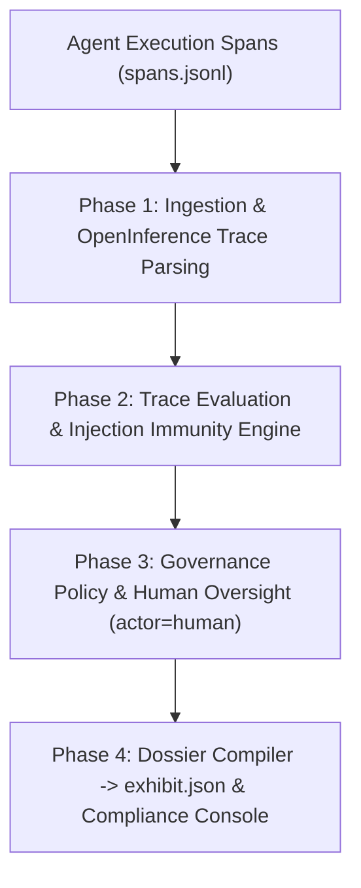

# Exhibit: EU AI Act Regulatory Evidence Pack Compiler & Agent Governance Dossier

> **Constitutional Rule**: *Not a conformity assessment. Counsel classifies. Exhibit produces immutable engineering artifacts.*

---

## Overview

European enterprises deploying autonomous AI agents face severe penalties under the EU Artificial Intelligence Act if their systems lack verifiable technical documentation, automated event logging (**Article 12**), demonstrated human oversight (**Article 14**), and proven robustness/cybersecurity (**Article 15**).

**Exhibit** ingests OpenInference and OpenTelemetry agent execution spans (`spans.jsonl`), evaluates traces using deterministic heuristic judges and LLM evaluators, verifies Article 50 AI transparency, captures cryptographic human reviewer sign-offs (`actor=human`), and compiles an immutable `exhibit.json` dossier mapping directly to statutory articles.

---

## Core Regulatory Mapping

- **Article 12 (Automatic Logging)**: Tamper-evident execution traces, SHA-256 digests of all inputs and outputs, execution durations, and model identification.
- **Article 14 (Human Oversight)**: Named reviewer credentials (e.g. Dr. Aris Thorne), timestamped intervention records, and signed audit receipts. Anonymous or automated compliance rubber-stamping is prohibited.
- **Article 15 (Accuracy, Robustness & Cybersecurity)**: Prompt injection immunity benchmarks (`ex-inject-01`), JSON schema conformance rates, and an explicit `limitations` declaration.
- **Article 50 (Transparency & AI Disclosure)**: Verification that the agent explicitly declared itself as an artificial intelligence system.

---

## Architecture



---

## Quickstart

```bash
# Install dependencies
pip install -e .

# Run test suite
pytest

# Launch the compliance operator console
python -m exhibit.main serve --port 8000
```
